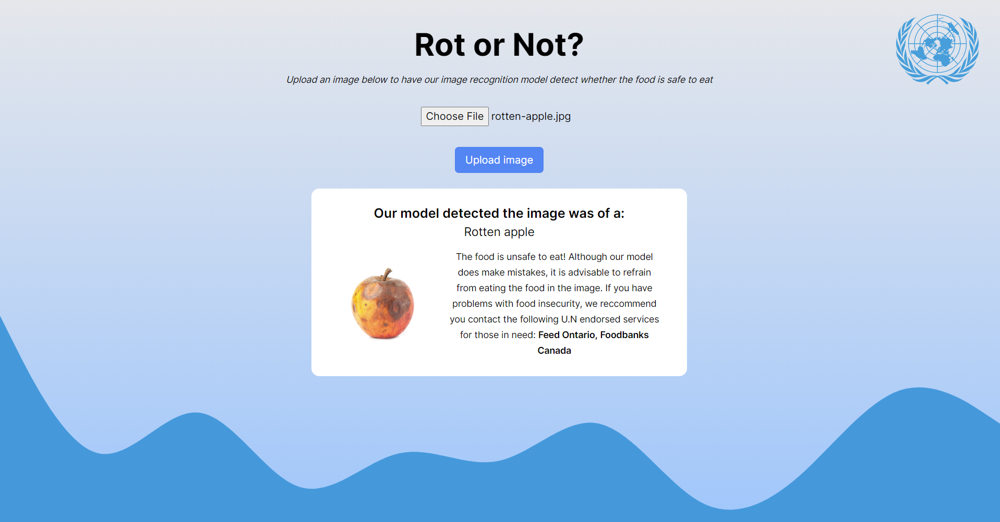

# oneBadApple: Rot or Not?



## Table of Contents

- [About](#about)
- [Key Features](#key-features)
- [Installation](#installation)
- [Contact](#contact)

## About

Addressing the United Nation's call to action for good health and wellbeing, one meal at a time

## Key Features

- Trained Image recognition model detects whether the food is safe to eat
- Responsive front-end that accepts file uploading and image detection
- Download datasets from Kaggle using Python Scripts

## Installation

1. Clone this repository:
   ```https://github.com/ValueAchooMatthew/OneBadApple.git```

2. Change the directory into the ```.\frontend``` folder

3. Run the Next.js app:
   ```npm run dev```

4. Open the Next.js application and upload your rotten fruits :>

## Contact
Connect with us on Linkedin :wave:

[Kelvin Y ](https://www.linkedin.com/in/kelvin-u/) | [Matthew C](https://www.linkedin.com/in/mcheung26/) | [Matthew F](https://www.linkedin.com/in/matthewtfarah/) | [Alan Z](https://www.linkedin.com/in/alan-zhou-893481246/)


